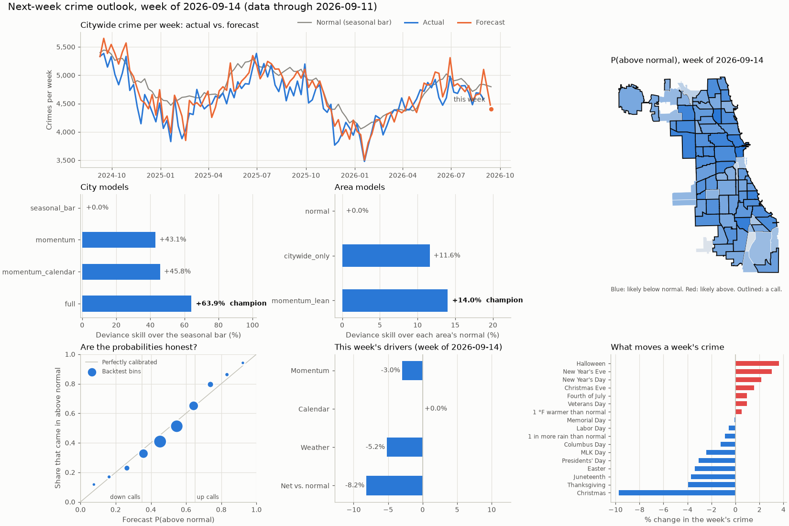

# Neighborhood Watch: a Chicago crime early-warning app on Databricks

Neighborhood Watch pairs Chicago's crime records with its 311 service requests, weather, street
permits and club listings to show, for each of the city's 77 community areas:
- how crime is running against **normal for this time of year**
- whether it's likely to come in **above or below normal next week**, and why
- which **upcoming events** tend to bring extra incidents nearby
- which **311 signals** (streetlights out, vacant buildings, dumping) have historically come before
  a rise in crime there

Residents subscribe to areas, set alert rules and file concern reports, and a chat agent answers
questions and takes those actions for them, grounded in the same data.


## What's inside

- **A medallion pipeline in Spark**: 18 Databricks notebooks take five public APIs from
  watermarked bronze pulls through cleaned silver tables to gold trend metrics, normals and
  per-resident profiles for every area. One nightly Lakeflow Job runs it.
- **Forecasting with an honest backtest.** A Poisson GLM on top of a seasonal baseline forecasts
  next week's crime citywide and per area, from momentum, holidays and the archived weather
  *forecast*, and builds the 8-day reporting lag into every feature. Walk-forward over 244 weeks,
  it removes 64% of the baseline's citywide error (deviance), and its area calls are right 75%
  of the time against a 48% base rate. Every run re-scores a leaderboard of challengers and logs
  to MLflow. [More](docs/modeling.md#next-week-outlook)
- **An events model**: how much crime past street festivals and club nights brought to the blocks
  around them (observed vs. controlled expected), and a Gamma-Poisson look-ahead for upcoming
  ones. [More](docs/modeling.md#events-look-ahead)
- **AI in the pipeline**: `ai_classify` maps crime types to seven categories once per pair, and
  `ai_query` writes a nightly plain-language summary per area from structured facts.
- **Lakebase (Postgres) for the app**: Synced Tables serve the trend data, OLTP tables hold users,
  subscriptions, alert rules and logs, and Change Data Feed carries every write back to Unity
  Catalog for analytics within seconds.
- **A tool-calling agent** with ten tools (eight reads, two writes), including hybrid search over
  Wikipedia passages in a Vector Search index. Every tool call and chat turn is logged for usage
  analytics and evaluation.
- **A FastAPI + HTMX app** deployed as a Databricks App: a Leaflet map with three layers, an
  area panel, alerts, an Insights page and the chat panel.



## Tech stack

| | |
|---|---|
| Data platform | Databricks: Spark, Delta Lake, Unity Catalog, Lakeflow Jobs, serverless compute |
| Operational store | Lakebase (managed Postgres): Synced Tables, Change Data Feed |
| AI | Foundation Model APIs (Claude Sonnet), AI Functions (`ai_classify`, `ai_query`), Vector Search, MLflow |
| Models | numpy, pandas, scipy, scikit-learn (Poisson GLM, negative binomial, Gamma-Poisson), H3 |
| App | FastAPI, Jinja2, HTMX, Alpine.js, Leaflet + MapLibre, Chart.js, Pico CSS |
| Sources | Chicago Data Portal (Socrata SODA), Open-Meteo, setlist.fm, Ticketmaster, Wikipedia |

## Repo layout

| Path | What's there |
|---|---|
| [`notebooks/`](notebooks/) | the pipeline, numbered in run order (`00`-`09`) |
| [`src/`](src/) | shared Python: API clients, the models, the agent and its tools, area data, config |
| [`src/outlook/`](src/outlook/) | the next-week forecast: specs, features, models, evaluation, pipeline, report |
| [`webapp/`](webapp/) | the FastAPI app: routes, templates, static JS/CSS, fake-data mode |
| [`lakebase/`](lakebase/) | the Postgres schema, the app's grants, migrations |
| [`tests/`](tests/) | offline tests (pytest), plus a live smoke-test notebook |
| [`tutorials/`](tutorials/) | seven notebooks that walk through the design, runnable locally |
| [`offline_ml/`](offline_ml/) | the research sandbox where the forecasting and events models were chosen |
| [`docs/`](docs/) | architecture, modeling and operations docs, and the diagrams |

## Try it locally

No Databricks account needed for any of this.

```bash
python -m pip install -r requirements-dev.txt
```

The app, with canned data:

```bash
NW_FAKE_DATA=1 SESSION_SECRET=local-dev-only uvicorn webapp.main:app --reload
```

The tests:

```bash
python -m pytest
```

The tutorials pull small samples from the public APIs (or use local exports if you have them):

```bash
python -m pip install -r tutorials/requirements.txt
```

```bash
jupyter lab tutorials/
```

## Docs

- [Architecture](docs/architecture.md): the data flow, every table, the app, the agent and the
  design decisions. The diagrams are in [`docs/architecture/`](docs/architecture/), editable in
  diagrams.net or Lucidchart.
- [Modeling](docs/modeling.md): the forecast, the events model and the lead-lag analysis, with
  results and how to extend them.
- [Operations](docs/operations.md): standing it up on a workspace, the nightly job, upkeep and
  gotchas.
- [Tutorials](tutorials/README.md): a guided tour, notebook by notebook.

## Data and attribution

Crime, 311 and permit data from the [City of Chicago Data Portal](https://data.cityofchicago.org)
(crimes are reported incidents, not convictions, and arrive about a week behind). Weather from
[Open-Meteo](https://open-meteo.com) (CC BY 4.0). Area background from Wikipedia (CC BY-SA 4.0;
each passage links its article). Concert data from setlist.fm and Ticketmaster.
