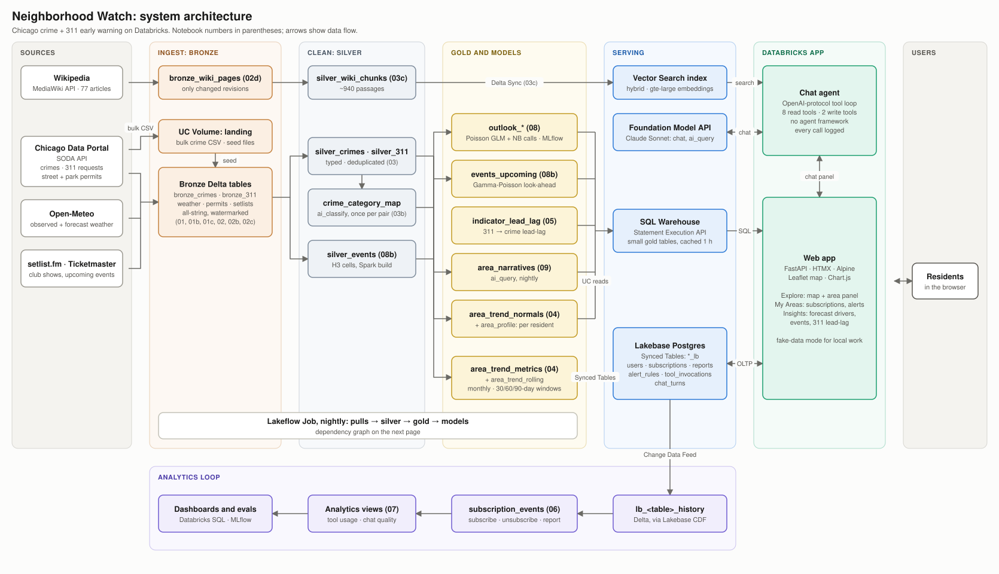
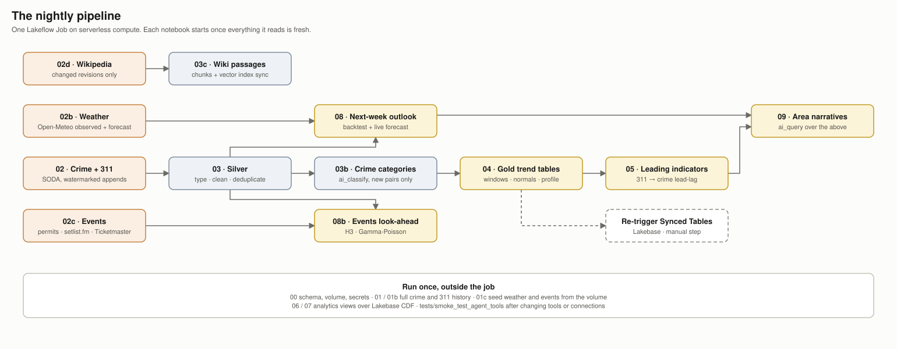
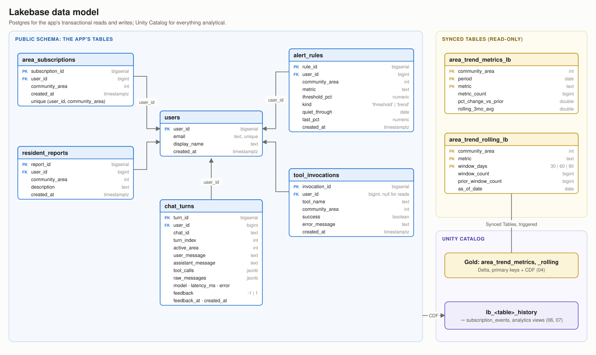
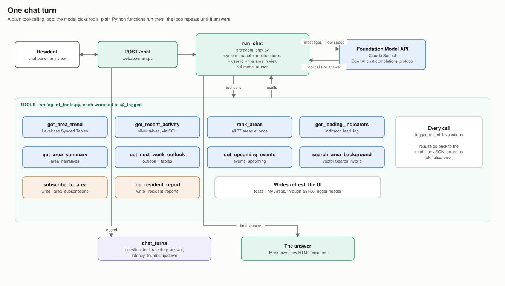

# Architecture

How Neighborhood Watch is put together: the data flow, every table, the app and the agent, and
the design decisions behind them. The diagrams are in [`architecture/`](architecture/): an editable
[`architecture.drawio`](architecture/architecture.drawio) (diagrams.net, or Lucidchart via File →
Import → draw.io) and an SVG per page. They're generated by
[`build_diagrams.py`](architecture/build_diagrams.py), so edit that and re-run it rather than the outputs.

## The layers

| Layer | Where | What happens |
|---|---|---|
| Sources | Chicago Data Portal (SODA), Open-Meteo, setlist.fm, Ticketmaster, Wikipedia | public APIs, pulled incrementally |
| Bronze | Delta tables in Unity Catalog | raw API rows, append or MERGE, watermarked |
| Silver | Delta | typed, cleaned, deduplicated; crime categories; Wikipedia passages; the event table |
| Gold and models | Delta | trend tables, normals, per-resident profile, lead-lag, outlook, events look-ahead, narratives |
| Serving | Lakebase Postgres, SQL warehouse, Vector Search, Foundation Model API | what the app reads at request time |
| App | Databricks App (FastAPI + HTMX) | the map, area panel, My Areas, Insights and the chat agent |
| Analytics | Lakebase CDF → Delta history → views | app writes, tool usage and chat quality, back in Unity Catalog |

Shared Python lives in `src/` and is imported as `src.*` from the repo root, the same way in the
notebooks, the app and the tests. Workspace-specific names (catalog, schema, Lakebase project,
warehouse, secret scope, model endpoint) are all in [`src/config.py`](../src/config.py).

## The pipeline

| Notebook | Writes | Runs |
|---|---|---|
| `00_setup` | the schema, the `landing` volume; checks the secret scope | once |
| `01_bronze_bulk_load_crimes` | `bronze_crimes` from the bulk CSV export | once |
| `01b_bronze_bulk_load_311` | `bronze_311`, a month at a time, resumable | once |
| `01c_seed_from_volume` | `bronze_weather_observed`, `bronze_weather_forecast`, `bronze_cdot_permits`, `bronze_park_permits`, `bronze_park_polygons`, `bronze_setlists`, `bronze_ticketmaster`, from raw API responses uploaded once | once |
| `02_bronze_incremental` | appends to `bronze_crimes`, `bronze_311` | nightly |
| `02b_bronze_weather` | `bronze_weather_observed`, `bronze_weather_forecast` | nightly |
| `02c_bronze_events` | `bronze_cdot_permits`, `bronze_park_permits`, `bronze_park_polygons`, `bronze_setlists`, `bronze_ticketmaster` | nightly |
| `02d_bronze_wikipedia` | `bronze_wiki_pages` (changed revisions only) | nightly |
| `03_silver_tables` | `silver_crimes`, `silver_311` | nightly |
| `03b_crime_categories` | `crime_category_map` (`ai_classify` on new pairs only) | nightly |
| `03c_wiki_chunks` | `silver_wiki_chunks`; creates or syncs `area_wiki_chunks_index` | nightly |
| `04_gold_area_trend_metrics` | `area_trend_metrics`, `area_trend_rolling`, `area_trend_normals`, `area_profile` | nightly |
| `05_leading_indicators` | `indicator_lead_lag` | nightly |
| `06_subscription_events_view` | `subscription_events` (a view) | once |
| `07_agent_analytics` | `subscription_events_daily`, `tool_invocation_events`, `tool_usage_daily`, `chat_turns_current`, `chat_turns_daily`, `chat_eval_set` (views) | once |
| `08_next_week_outlook` | `outlook_city_week`, `outlook_area_week`, `outlook_summary`, `outlook_coefficients`, `outlook_leaderboard`, `outlook_calibration` | nightly |
| `08b_events_lookahead` | `silver_events`, `silver_event_cells`, `events_upcoming`, `events_priors` | nightly |
| `09_area_narratives` | `area_narratives` (`ai_query`; areas whose data moved) | nightly |

Dependencies in the nightly job: `02`, `02b`, `02c` and `02d` start together. `03` follows `02`,
then `03b`, `04` and `05`. `03c` follows `02d`. `08` needs `03` and `02b`; it reads silver, not
gold, so it runs beside `03b`/`04`. `08b` needs `03` and `02c`. `09` needs `04`, `05` and `08`.
The Synced Tables are re-triggered after `04`.

### Ingestion patterns

- **Bulk, then incremental.** Crimes start from the portal's CSV export (`01`); 311 from a
  month-by-month API backfill (`01b`); weather and events from raw API responses uploaded to the
  volume once (`01c`), which saves API quota. After that, nightly notebooks pull only what's new,
  watermarked on the bronze table itself.
- **Three write modes** (`src/spark_bronze_utils.py`): batched appends for the big SODA datasets;
  MERGE on a key for small keyed pulls (weather, setlists, Wikipedia), where a seeded row never
  overwrites a live one; and atomic `replaceWhere` windows for sources whose past rows change
  (permits re-pull the last 180 days; Ticketmaster replaces its daily snapshot).
- **Bronze is all-string for SODA data.** The bulk CSV and the JSON API must agree on a schema,
  and Socrata serializes booleans unquoted, which Spark would otherwise infer as booleans that
  Delta can't merge into strings. Typing happens in silver.

### Gold

`04` builds one metric-labeled event base from silver (`crime_total`, seven `crime_<category>`
metrics, `311_total` and ten 311 types chosen as physical-disorder signals) and derives four tables
from it. Its design choices:
- **One as-of date**: the earlier of crime's and 311's last *full* day. The crime feed's newest
  day is a stub (14 records against ~650), so a day counts once it has half the median of the
  previous 28. Everything is cut at that date, so windows and the app's partial-month projection
  line up.
- **"Better or worse" compares complete windows**, never a partial month against a full one, and
  **against normal for this time of year**, not just the prior window, which swings with whatever
  it happened to hold.
- **Zero-filled grids** from a real month sequence, so a quiet month is a 0 rather than a gap.

## Serving

Two paths, chosen by access pattern:

| Path | Tables | Why |
|---|---|---|
| **Lakebase Synced Tables** | `area_trend_metrics_lb`, `area_trend_rolling_lb` | read on every area click and by most agent tools: low-latency Postgres |
| **SQL warehouse, cached 1 h in the app** | normals, profile, lead-lag, outlook, events, narratives, weather forecast | small, change once a night: no extra Synced Tables to create and trigger |
| **Vector Search** | `area_wiki_chunks_index` | hybrid (embedding + keyword) retrieval for the agent |
| **Lakebase OLTP** | users, subscriptions, reports, alert rules, tool invocations, chat turns | the app's own transactional writes |

`src/db_connect.py` authenticates as whatever identity runs the code (a notebook's user, or the
app's service principal), minting a short-lived Lakebase OAuth credential per connection. There
are no stored secrets for Databricks services.

## The app

`webapp/` is FastAPI with Jinja templates, HTMX for partial updates and Alpine for small client
state, Leaflet (OpenFreeMap vector tiles) for the map and Chart.js for charts.

- **Explore**: the community-area map with three layers (trend vs. normal, next week's outlook,
  crime per capita) and the area panel: the crime card, 311 requests, crime by type, the rolling
  12-month change, and four cards that load separately (the week ahead, upcoming events, what's
  happening here, signals to watch). All of Chicago is area 0 and the default view.
- **My Areas**: subscriptions and two kinds of alert rule. A *threshold* rule flags when a metric
  is up at least N%; a *trend* rule reports on every data pull whether a rise is climbing,
  holding or easing. Rules only fire on data newer than when they were set or last cleared.
- **Insights**: this week's forecast drivers and daily weather, festival and club-night lift,
  and the 311 → crime lead-lag heatmap.
- **Chat**: a floating panel; agent writes refresh My Areas and confirm with a toast.

Only what changed re-renders: each form or selector swaps one template partial, and the map and
charts draw client-side from small JSON endpoints. Panels that read the SQL warehouse load after
the panel itself, so a cold warehouse never blocks a click. `NW_FAKE_DATA=1` swaps every data call
for deterministic canned data (`webapp/_fake.py`), for UI work without Databricks.

## The agent

Ten tools in `src/agent_tools.py`: eight reads (trends, recent records, cross-area ranking,
leading indicators, the nightly narrative, the outlook, upcoming events, Wikipedia background)
and two writes (subscribe, file a report). `src/agent_chat.py` runs a plain tool-calling loop
against the Foundation Model API through the standard `openai` client. There's no agent framework:
each tool is an ordinary function that returns `{"ok": ...}` instead of raising, `@_logged` writes
every call to `tool_invocations`, and each turn (question, tool trajectory, answer, latency,
feedback) goes to `chat_turns` for evaluation.

The system prompt carries the real metric names (the model otherwise guesses plausible wrong
ones, and `resolve_metric` maps loose names), the logged-in user and the area in view, and rules
for honest framing: always name the baseline, keep a forecast's citywide and local parts apart,
call correlations correlations, never use Wikipedia's dated figures for current levels, and use
imperial units.

## Analytics loop

Lakebase Change Data Feed lands every `public` table's changes in Unity Catalog as
`lb_<table>_history` within seconds (`REPLICA IDENTITY FULL` keeps whole row images). `06` turns
subscriptions, unsubscriptions and reports into one `subscription_events` stream; `07` adds tool
usage and success rates, daily chat quality (tool use, errors, latency percentiles, thumbs up),
and `chat_eval_set`, an evaluation-ready view of every turn.

## Design decisions

- **Unity Catalog for analytics, Lakebase for the app.** Row-level history stays in Delta
  (`get_recent_activity` reads silver through SQL rather than syncing millions of rows into
  Postgres); Postgres holds only what the app reads per click and writes.
- **FastAPI + HTMX instead of Streamlit.** The first version was Streamlit; every interaction
  re-ran the whole script. Partial swaps made the app feel instant and let it look designed.
- **Nightly batch for anything an LLM writes.** Crime categories and narratives come from AI
  Functions in the pipeline, so the app reads a finished row and every sentence traces back to
  the numbers in `context_json`.
- **Models live in plain Python** (`src/outlook/`, `src/events_model.py`,
  `src/leading_indicators.py`), tested locally on synthetic data and run by notebooks on
  Databricks. The research that chose them is in `offline_ml/`.
- **Imperial units everywhere a person reads them.** Models keep their sources' units (°C, cm);
  conversion happens once, in the shaping layer and the narrative prompt.
- **Configuration in one place.** Every workspace-specific name is in `src/config.py`, with
  environment-variable overrides.
